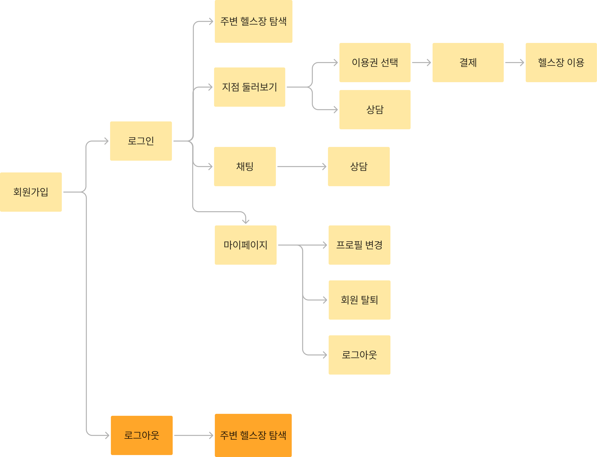

# 8lo8lome 파이널 프로젝트

### [배포사이트](https://daitgym.netlify.app/main)

  <!-- 첫 번째 계정 -->
  

    <h3>🕹️ 유저 계정 🕹️</h3>
    <h4>ID</h4>
    <code>user1234@naver.com</code>
    <h4>PASSWORD</h4>
    <code>user1234</code>
  

  <!-- 두 번째 계정 -->
  

    <h3>🕹️ 헬스장 계정 🕹️</h3>
    <h4>ID</h4>
    <code>admin1234@naver.com</code>
    <h4>PASSWORD</h4>
    <code>admin1234</code>
  

</code>
 

## 목차

- [프로젝트 개요](#프로젝트-개요)
- [유저 플로우](#유저-플로우)
- [화면 구성 & 구현 기능](#화면-구성--구현-기능)
- [기술 스택](#기술-스택)

## 프로젝트 개요

  
내 주변 헬스장 가격, 한눈에 비교!
  

 
 
 

## 유저 플로우

---

## 화면 구성 & 구현 기능

### 유저 서비스

**회원가입 및 로그인**

회원가입

로그인

**이메일찾기, 비밀번호 변경**

이메일 찾기

비밀번호 변경

**로그아웃, 회원탈퇴**

로그아웃

회원탈퇴

**프로필 이미지변경, 이메일 변경, 닉네임 변경**

### 위치 서비스 및 필터

**현재 위치를 기반으로 가장 가까운 헬스장을 보여주며 설정 위치를 변경도 가능합니다.**

**검색과 필터를 사용하여 원하는 항목을 볼 수 있습니다**

### 헬스장 상세 페이지

**가격, 운영 시간, 트레이너 정보, 리뷰, 환불 규정 등을 확인할 수 있습니다.**

### 결제 기능

**헬스장 이용권과 PT 이용권의 가격을 비교하고 선택할 수 있으며, 회원복 및 락커 요금도 선택한 개월 수에 맞게 추가됩니다. 결제 내역도 확인할 수 있습니다.**

### 채팅 기능

**헬스장과 실시간 상담 기능을 제공하며, 채팅방 목록을 최신순으로 정렬하여 보여줍니다. 채팅방 삭제 및 채팅 내역 삭제도 가능합니다.**

### 리뷰 관리

**내가 작성한 리뷰 목록을 확인할 수 있으며, 각 리뷰를 통해 해당 헬스장으로 이동하는 링크도 제공합니다.**

### 찜 기능

**관심 있는 헬스장을 찜 목록에 추가 및 관리할 수 있으며, 찜한 헬스장은 언제든지 찜 해제 가능합니다.**

---

## 회고

| 팀원   | 회고 내용                                                                                                                                                                                                   |
| ------ | ----------------------------------------------------------------------------------------------------------------------------------------------------------------------------------------------------------- |
| 최다경 | 꾸준하고 소통을 잘해 주는 팀원분들을 만나 리액트와 포켓 베이스에 대해서 알게 된 것이 많아 좋았다. 그리고 프로젝트를 하면서 어떻게 공부를 해야 하는지 방향을 잡을 수 있는 경험이었습니다.                    |
| 이희재 | 이 과정을 거치면서 신경 써야 할 부분과 배워야 할 것들이 점점 많아진다는 것을 느꼈다. 아직도 해결해야 할 어려움이 많지만, 이러한 경험들을 통해 성장에 큰 도움이 되었다고 생각합니다.                         |
| 이예린 | 피그마와 리액트에 더 익숙해 질 있었다. 수업때 잘 이해하지 못했던 부분도 직접 부딛쳐보면서 수업 내용이 이해가 가기도 했다. 바닐라 프로젝트를 진행했을때 보다 얼마나 성장했는지 확인해 볼 수 있는 시간이었다! |
| 오정호 | 부족한 점을 개선해 나갈 수 있는 좋은 시간이었다. 협업과 의사소통 능력이 개발 능력만큼 중요하다는 걸 알게 되는 좋은 경험이었습니다.                                                                          |

---

### 기술 스택

**프론트엔드 개발**

### 프로그래밍 언어

### 스타일링

### 도구 및 플랫폼

### 메신저

---

